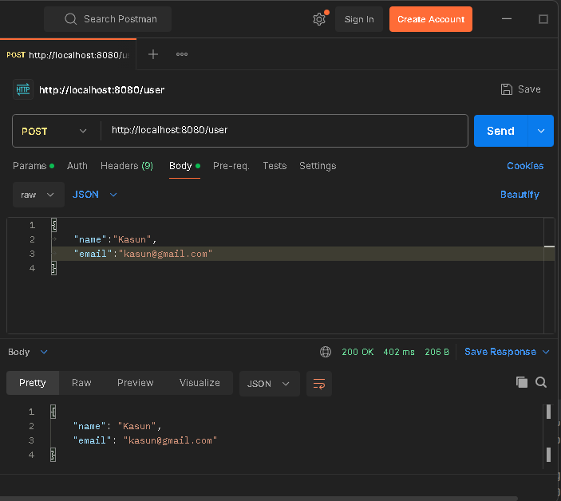
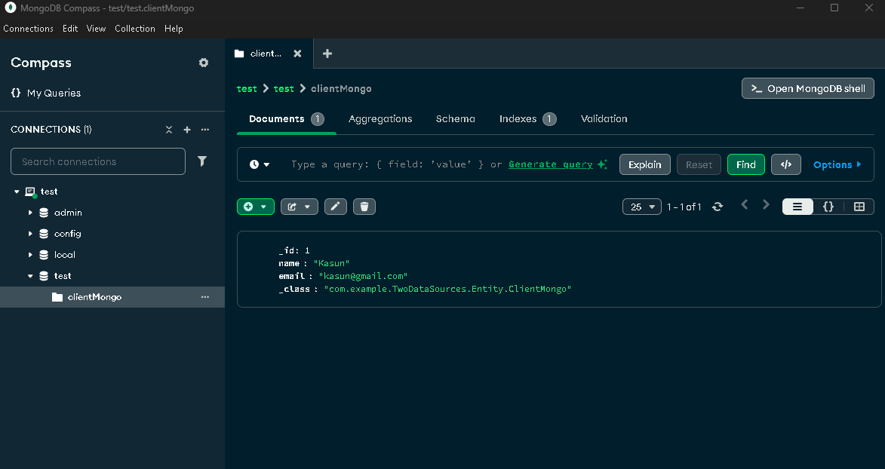
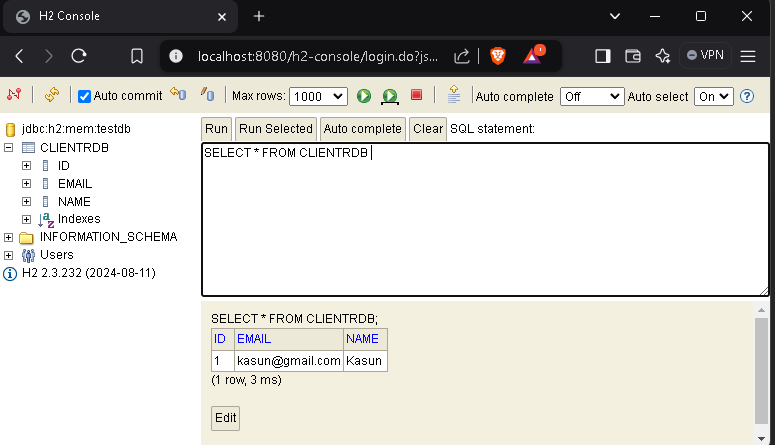

# Simple Spring Boot Application with MongoDB and H2 DB Works Together 

This Spring Boot application showcases the integration of both SQL (H2) and NoSQL (MongoDB) databases. It is designed to handle POST requests containing user details, which are then stored in both database systems. This dual-database configuration allows for effective data management and retrieval across different database types, demonstrating the flexibility of Spring Boot in handling diverse data storage solutions.

## Table of Contents

- [Technologies Used](#technologies-used)
- [Program Specification](#program-specification)
- [Input](#input)
- [Output](#output)
- [Setup Instructions](#setup-instructions)
- [How to Run the Application](#how-to-run-the-application)
- [License](#license)

## Technologies Used

<table>
    <tr>
        <td align="center">
            <a href="https://www.java.com" target="_blank" rel="noreferrer"> 
                 
            </a><br> Java 17
        </td>
        <td align="center">
            <a href="https://spring.io/projects/spring-boot" target="_blank" rel="noreferrer"> 
                 
            </a><br> Spring Boot 3.4.0
        </td>
        <td align="center">
            <a href="https://www.mongodb.com/" target="_blank" rel="noreferrer"> 
                 
            </a><br> Mongo DB 4.4.0
        </td>
        <td align="center">
            <a href="https://maven.apache.org/" target="_blank" rel="noreferrer"> 
                 
            </a><br> Maven 4.0.0
        </td>
        <td align="center">
            <a href="https://www.h2database.com/" target="_blank" rel="noreferrer"> 
                 
            </a><br> H2 Database 2.1.214
        </td>
    </tr>
</table>

## Program Specification

- **Input**: Send POST request to API endpoint.
- **Process**: Save received data into H2 and MongoDB.
- **Output**: Return saved data to same POST request.

## Input

You can use [Postman](https://www.postman.com) to send user details to the exposed API endpoint (Make sure application is up and running).<br>
Here is the sample request body:
```json
{
  "name": "Kasun Hasanka",
  "email": "kasun@gmail.com"
}
```
Default API endpint URL : http://localhost:8080/user



## Output

By using H2 console and [MongoDBCompass](https://www.mongodb.com/products/tools/compass) you can check inserted data persistence in both H2 and mongoDB servers.






## Setup Instructions

1. **Clone the Repository**:
   ```bash
   git clone https://github.com/khasanka/MongoH2Together.git
   cd MongoH2Together
   ```
   
2. **Build the Project**:
   
   Make sure you have Maven installed. Run the following command to build the project.
   
   ```bash
   mvn clean install
   ```

## How to Run the Application

**Run the application using your IDE or by executing the following command in your terminal.**

```bash
   mvn spring-boot:run
```

## License

  **This project is licensed under the MIT License. Feel free to use, modify, and distribute this application as per the terms of the license.**


